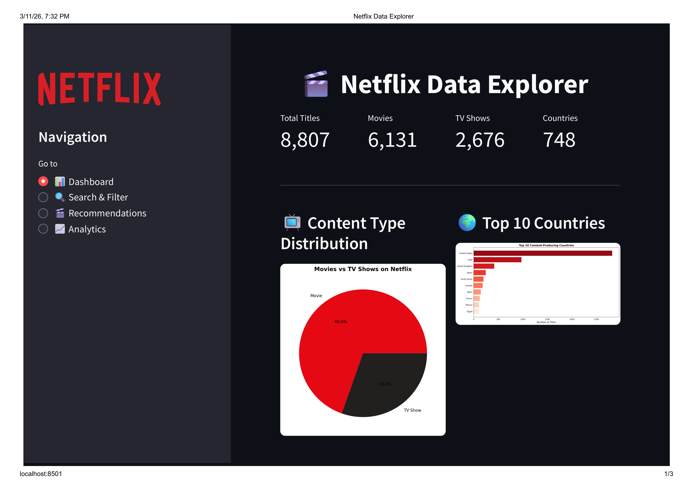
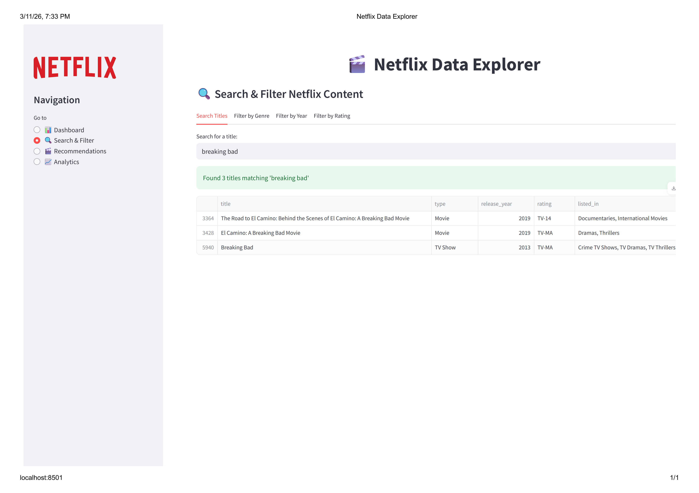
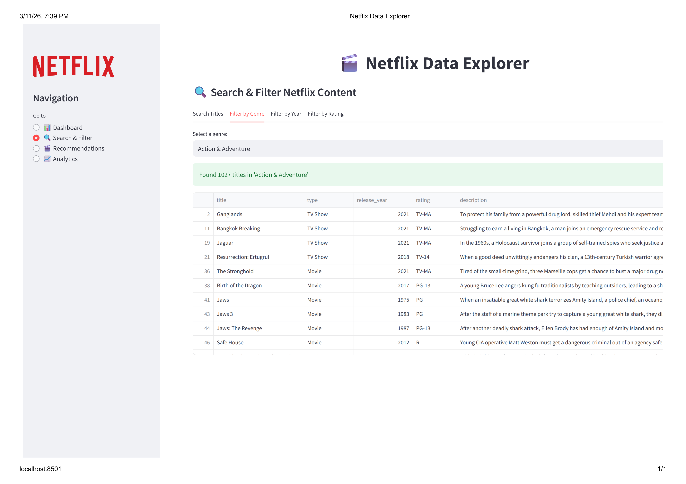
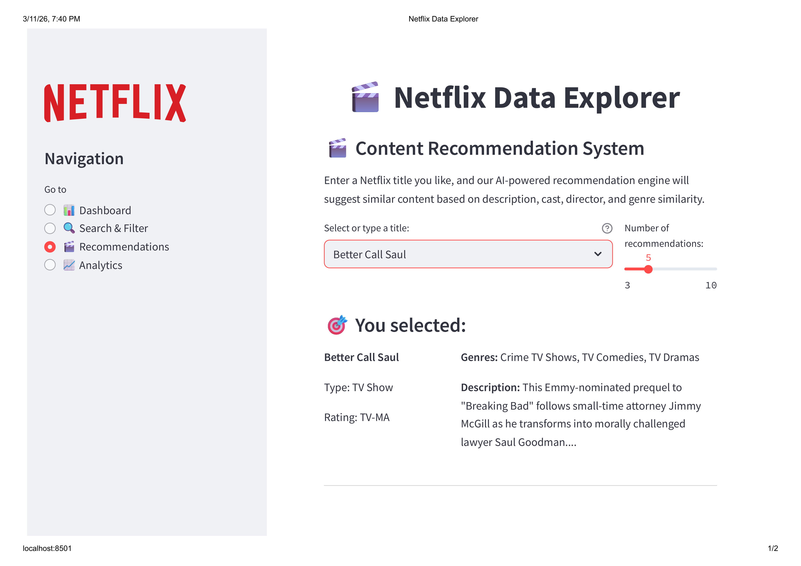
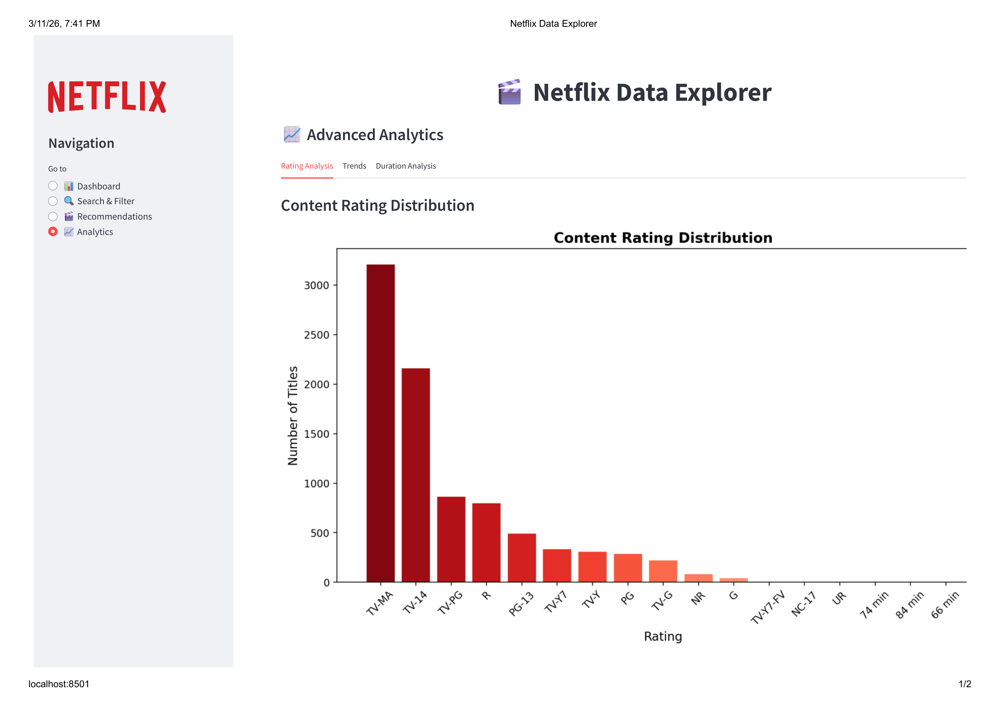

# 🎬 Netflix Data Analysis & Prediction System

[](https://netflix-data-analysis-prediction.streamlit.app/)


> Netflix data exploration, visualization, and recommendation system using Python, Seaborn, and Streamlit.

---

## 🚀 Live Demo

**👉 [Click here to try the app live!](https://netflix-data-analysis-prediction.streamlit.app/)**

No installation needed — runs directly in your browser!

---

## 📌 Overview

This project provides comprehensive analysis of Netflix's content library with **8,800+ titles**. It includes:

- 📊 **Data Analysis**: Explore trends in content production, popular genres, and content distribution
- 🌐 **Interactive Dashboard**: A beautiful Streamlit web application for exploring the data
- 🤖 **Recommendation System**: AI-powered content recommendations using TF-IDF and cosine similarity
- ⌨️ **Command-line Interface**: Quick access to insights and recommendations from the terminal

---

## 📸 App Screenshots

### Dashboard Overview


### Content Analysis


### Genre Distribution


### Country-wise Analysis


### Advanced Analytics


---

## 📈 Key Insights from Notebook Analysis

### Movies vs TV Shows

- Netflix has more movies (~70%) than TV shows (~30%)

### Top Content-Producing Countries

- United States leads with the most content
- India, UK, and Canada follow

### Content Added Over the Years

- Content addition has grown significantly since 2015
- Peak content addition in 2019-2020

### Top Genres

- International Movies, Dramas, and Comedies dominate
- Documentaries and Kids' TV also popular

### Word Cloud of Titles

- Common words in titles visualized

---

## 🔧 Tech Stack

| Technology | Purpose |
|-----------|---------|
| **Python** | Core programming language |
| **Pandas & NumPy** | Data manipulation and analysis |
| **Matplotlib & Seaborn** | Static visualizations |
| **WordCloud** | Text visualization |
| **scikit-learn** | TF-IDF vectorization & cosine similarity for recommendations |
| **Streamlit** | Interactive web dashboard |
| **Jupyter Notebook** | Exploratory analysis |

---

## 📊 Features

### 1. Interactive Web Dashboard

The Streamlit app (`app.py`) provides:

- **📊 Dashboard**: Key metrics and visualizations at a glance
- **🔍 Search & Filter**: Find content by title, genre, year, or rating
- **🎬 Recommendations**: Get similar content suggestions for any title
- **📈 Analytics**: Deep dive into ratings, trends, and duration analysis

### 2. Command-line Analysis

The analyzer script (`netflix_analyzer.py`) offers:

```python
from netflix_analyzer import NetflixAnalyzer

# Initialize
analyzer = NetflixAnalyzer("netflix_titles.csv")

# Get statistics
stats = analyzer.get_basic_stats()

# Get recommendations
recommendations = analyzer.recommend("Breaking Bad", n=5)

# Search titles
results = analyzer.search_titles("stranger")

# Filter by genre
comedies = analyzer.filter_by_genre("Comedy")
```

### 3. Jupyter Notebook Analysis

The original notebook (`Netflix_Analysis.ipynb`) contains step-by-step exploratory analysis.

---

## 🚀 Quick Start

### Installation

```bash
# Clone the repository
git clone https://github.com/kartikey-kk/Netflix-Data-Analysis-Prediction.git
cd Netflix-Data-Analysis-Prediction

# Install dependencies
pip install -r requirements.txt
```

### Run the Web Dashboard

```bash
streamlit run app.py
```

### Use the Command-line Interface

```bash
# Show basic statistics
python netflix_analyzer.py --stats

# Get recommendations for a title
python netflix_analyzer.py --recommend "Narcos"

# Search for titles
python netflix_analyzer.py --search "Stranger"

# Filter by genre
python netflix_analyzer.py --genre "Documentary"

# Filter by year range
python netflix_analyzer.py --year 2020 2021

# Show top countries
python netflix_analyzer.py --top-countries 10

# Generate all visualizations
python netflix_analyzer.py --visualize --output-dir output
```

---

## 🤖 Recommendation System

Our recommendation engine uses **TF-IDF (Term Frequency-Inverse Document Frequency)** vectorization combined with **Cosine Similarity** to find similar content.

### Features Used for Recommendations:
- Title
- Description
- Cast
- Director
- Genres (listed_in)

### Example Usage:

```python
from netflix_analyzer import NetflixAnalyzer

analyzer = NetflixAnalyzer("netflix_titles.csv")

# Get 5 recommendations for "Narcos"
recommendations = analyzer.recommend("Narcos", n=5)

for rec in recommendations:
    print(f"{rec['title']} - Similarity: {rec['similarity_score']}")
```

---

## 📁 Project Structure

```
Netflix-Data-Analysis-Prediction/
├── app.py                    # Streamlit web dashboard
├── netflix_analyzer.py       # Core analysis class & CLI
├── Netflix_Analysis.ipynb    # Jupyter notebook analysis
├── netflix_titles.csv        # Dataset (8,800+ titles)
├── requirements.txt          # Python dependencies
├── images/                   # App screenshots & visualizations
│   ├── dashboard_overview.png
│   ├── content_analysis.png
│   ├── genre_distribution.png
│   ├── country_analysis.png
│   ├── advanced_analytics.png
│   ├── output.png
│   ├── output2.png
│   ├── output3.png
│   ├── output4.png
│   └── output5.png
└── README.md
```

---

## 📝 Dataset

The dataset contains information about Netflix titles including:

| Column | Description |
|--------|-------------|
| show_id | Unique ID |
| type | Movie or TV Show |
| title | Name of the title |
| director | Director name(s) |
| cast | Cast members |
| country | Production country |
| date_added | Date added to Netflix |
| release_year | Year of release |
| rating | Content rating (PG, R, etc.) |
| duration | Duration (minutes or seasons) |
| listed_in | Genres |
| description | Brief description |

---

## 🙏 Acknowledgments

- Dataset: [Netflix Movies and TV Shows](https://www.kaggle.com/shivamb/netflix-shows) on Kaggle
- Netflix logo and branding belong to Netflix, Inc.

---

## 📄 License

This project is open source and available under the [MIT License](LICENSE).

---

## 🤝 Contributing

Contributions are welcome! Feel free to:

1. Fork the repository
2. Create a feature branch
3. Commit your changes
4. Push to the branch
5. Open a Pull Request

---

Made with ❤️ by [kartikey-kk](https://github.com/kartikey-kk) for data enthusiasts and Netflix fans